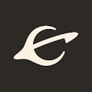
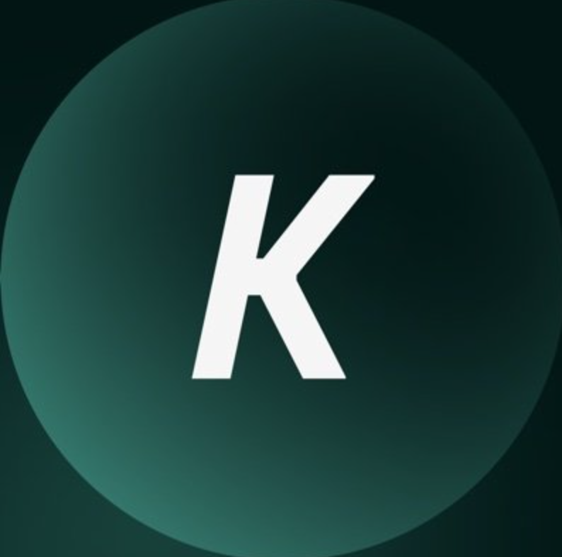
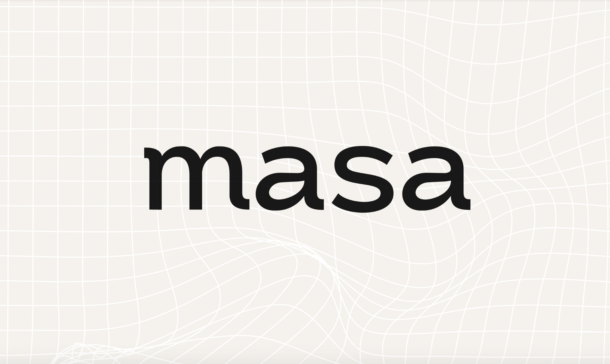
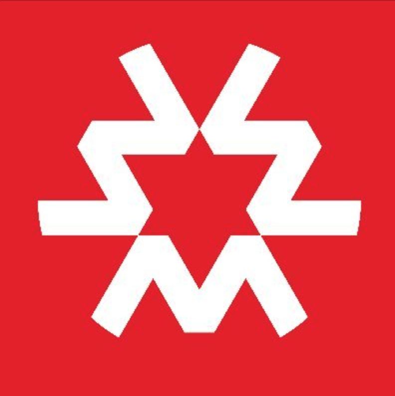
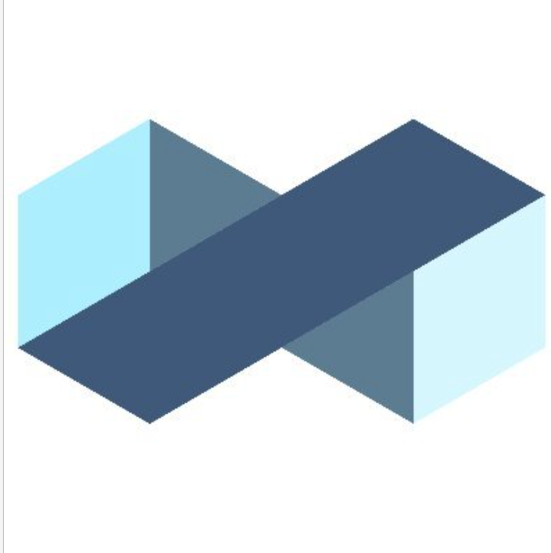
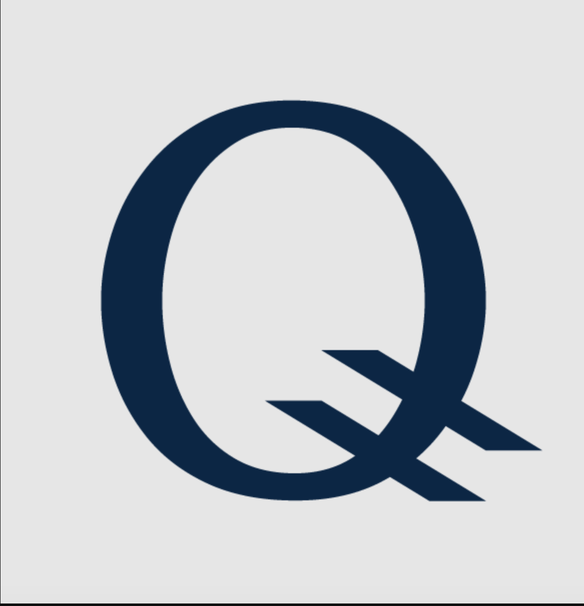
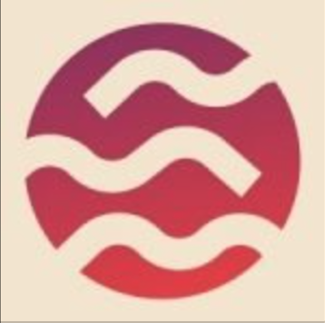
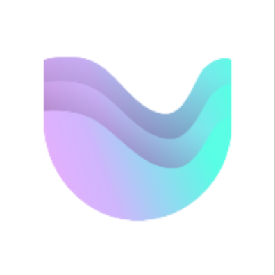
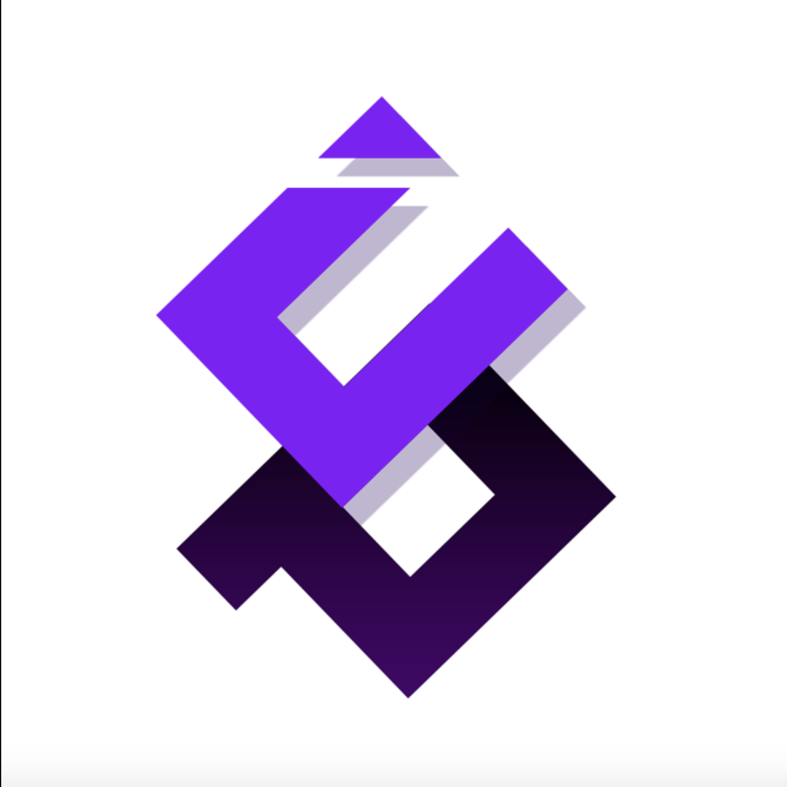

## I am Aleksandr. A crypto enthusiast, maybe even cosmos ecosystem geek.

### I have quite a large portfolio of testnets:Umee, Kujira, Arhcway, Penumbra, Quicksilver, Sei, Stride, Stratos, Gnoland, Rebus, Teriroti, Noise, Ollo, HAQQ, Terp Network, Uptick, okp4, Empower, Neutron, SSV Network, Noise, Nibiru, Kyve, Forta, Quai Network, Masa finance, Massa, DeFund and others.

